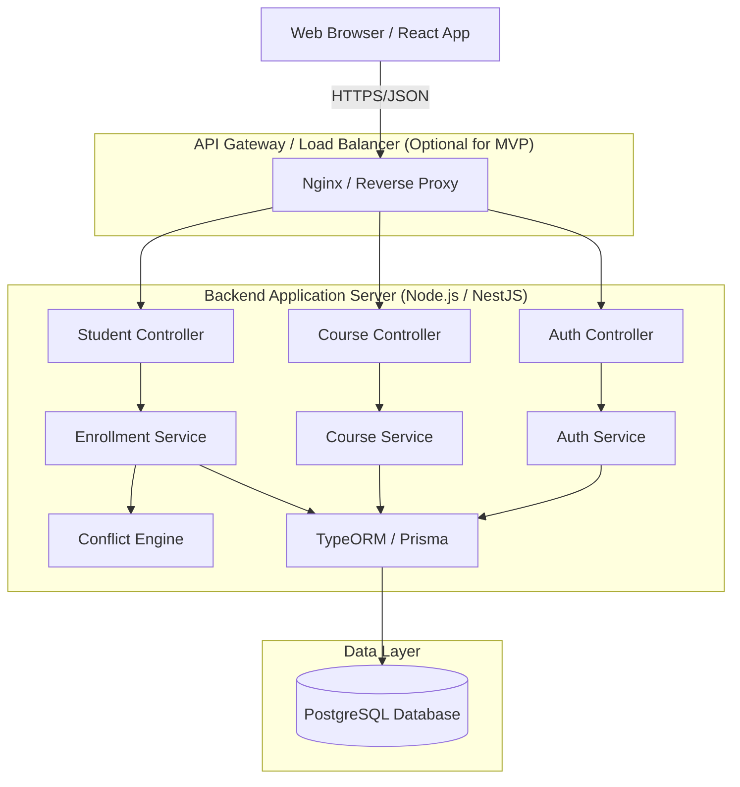
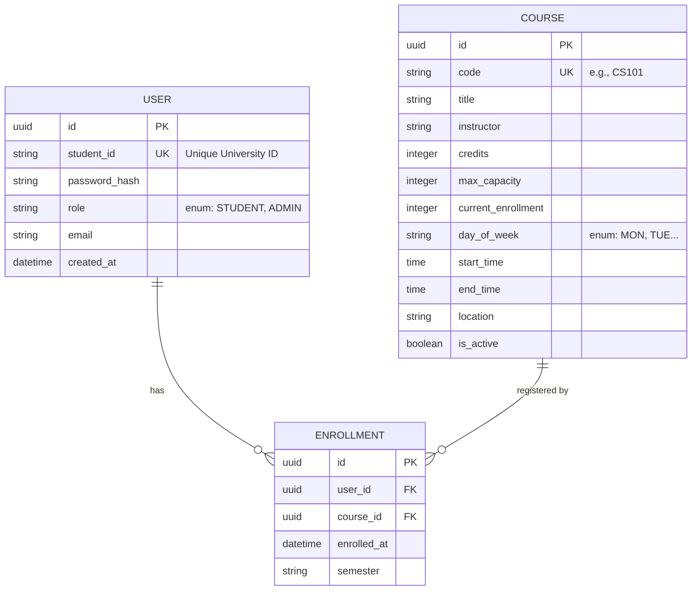

# Software Architecture Design Document
## Student Course Selection System (MVP)

**Version:** 1.0  
**Status:** Design Draft  
**Author:** Software Architect  

---

## 1. System Architecture Overview

### 1.1 Architectural Pattern
The system will adopt a **Monolithic Client-Server Architecture** using the **Model-View-Controller (MVC)** pattern. Given the scope of the MVP and the strong data consistency requirements (specifically for course capacity and scheduling conflicts), a monolithic approach ensures transactional integrity without the complexity of distributed transactions.

### 1.2 High-Level Diagram


### 1.3 Key Principles
1.  **Separation of Concerns:** Business logic is encapsulated in Services, while HTTP handling is managed by Controllers.
2.  **Data Integrity:** Database constraints and ACID transactions are used to prevent over-enrollment and data corruption.
3.  **Security:** Role-Based Access Control (RBAC) is enforced at the API level.
4.  **Scalability (Read):** While the write path is strictly consistent, the catalog read path can be cached (e.g., Redis) in future iterations to handle high traffic during registration periods.

---

## 2. Technology Stack

### 2.1 Frontend
| Component | Technology | Justification |
| :--- | :--- | :--- |
| **Framework** | React.js (v18+) | Component-based architecture, vast ecosystem, efficient DOM updates for dynamic schedules. |
| **State Management** | Redux Toolkit / Context API | Manage global state (User session, Cart/Schedule) and pass enrollment data efficiently. |
| **UI Library** | Material UI (MUI) or Tailwind CSS | Rapid prototyping, responsive design, pre-built components for forms and tables. |
| **HTTP Client** | Axios | Promise-based, supports interceptors for attaching JWT tokens. |

### 2.2 Backend
| Component | Technology | Justification |
| :--- | :--- | :--- |
| **Runtime** | Node.js | Non-blocking I/O, ideal for handling high concurrency of student registration requests. |
| **Framework** | NestJS | Structured, opinionated framework supporting TypeScript, Dependency Injection, and modular architecture. |
| **ORM** | Prisma or TypeORM | Type-safe database access, migration management, and efficient query building. |
| **Auth** | Passport.js + JWT (JSON Web Tokens) | Industry standard for stateless authentication, easy integration with RBAC. |

### 2.3 Database
| Component | Technology | Justification |
| :--- | :--- | :--- |
| **Database** | PostgreSQL | Relational data model fits perfectly (Students, Courses, Enrollments). Strict ACID compliance is required to prevent "double booking" of seats. |

---

## 3. Database Schema Design

The database is normalized to 3rd Normal Form (3NF) to ensure data integrity.

### 3.1 Entity Relationship Diagram (ERD)



### 3.2 Key Constraints & Indexes
*   **Unique Constraint:** `USER(student_id)` ensures no duplicate students.
*   **Unique Constraint:** `COURSE(code)` ensures no duplicate course codes.
*   **Foreign Keys:** `ENROLLMENT` references `USER` and `COURSE` with `ON DELETE CASCADE` (if a user is deleted, their enrollments vanish).
*   **Capacity Check:** Application-level logic combined with optimistic locking or row locking during transaction to ensure `current_enrollment <= max_capacity`.

---

## 4. Backend Modules

The backend is organized into distinct modules.

### 4.1 Authentication Module
**Responsibility:** Verify identity and manage sessions.
*   **Controller:** `AuthController`
    *   `POST /api/auth/login`: Validates credentials, returns JWT.
    *   `POST /api/auth/register`: (Optional MVP feature) Create new student accounts.
*   **Service:** `AuthService`
    *   Hashes passwords using bcrypt.
    *   Generates signed JWTs containing `userId` and `role`.
    *   Validates JWTs via middleware strategy.

### 4.2 Course Management Module
**Responsibility:** Admin CRUD operations and Student browsing.
*   **Controller:** `CourseController`
    *   `GET /api/courses`: Public (or Authenticated) access. Supports query params `?search=math&department=CS`.
    *   `POST /api/courses` (Admin only): Create course.
    *   `PUT /api/courses/:id` (Admin only): Update details.
    *   `DELETE /api/courses/:id` (Admin only): Delete if enrollment is 0.
    *   `GET /api/courses/stats` (Admin only): Enrollment metrics.
*   **Service:** `CourseService`
    *   Handles search filtering logic (SQL `LIKE` operators).
    *   Calculates `enrollment_ratio` for dashboard displays.

### 4.3 Student & Enrollment Module
**Responsibility:** Manages the student schedule and handles transactional logic.
*   **Controller:** `StudentController`
    *   `GET /api/student/schedule`: Returns current user's enrolled courses and total credits.
    *   `POST /api/student/enroll/:courseId`: Initiates add logic.
    *   `DELETE /api/student/drop/:courseId`: Initiates drop logic.
*   **Service:** `EnrollmentService` (Contains the core business logic)
    *   **`enrollCourse(userId, courseId)`**:
        1.  Start Transaction.
        2.  Fetch Course (Lock row).
        3.  Fetch User Enrollments.
        4.  Call `ConflictEngine.validate()`.
        5.  Check Capacity.
        6.  Create Enrollment Record.
        7.  Increment `Course.current_enrollment`.
        8.  Commit Transaction.
    *   **`dropCourse(userId, courseId)`**:
        1.  Start Transaction.
        2.  Calculate credits remaining *after* drop.
        3.  If credits < min (e.g., 12), throw warning (client must confirm).
        4.  Delete Enrollment Record.
        5.  Decrement `Course.current_enrollment`.
        6.  Commit Transaction.

---

## 5. Frontend Modules

The frontend is a Single Page Application (SPA).

### 5.1 Layout & Navigation
*   **App Shell:** Contains the main navigation bar.
*   **Route Protection:** `ProtectedRoute` component checks for JWT token existence; redirects to login if missing.

### 5.2 Authentication Views
*   **LoginPage:** Form for Student ID/Admin ID and Password.
*   **State:** Stores the JWT in `localStorage` and global Redux state.

### 5.3 Catalog Module
*   **CourseCatalogPage:**
    *   **SearchBar:** Inputs for text search.
    *   **FilterSidebar:** Checkboxes for departments, days of the week.
    *   **CourseList:** Iterates through results, renders `CourseCard`.
*   **CourseCard:** Displays code, title, instructor, time, and capacity bar. "Add Course" button triggers enrollment.

### 5.4 Student Dashboard Module
*   **SchedulePage:**
    *   **SummaryHeader:** Displays "Total Credits: X".
    *   **CalendarView / ListView:** Visual representation of the weekly schedule.
    *   **EnrolledList:** List of courses with "Drop" button.
*   **ConflictToast:** A notification component that appears if `enrollCourse` returns a 409 Conflict error.

### 5.5 Admin Dashboard Module
*   **AdminCourseManager:**
    *   **DataGrid/Table:** Lists all courses with "Edit" and "Delete" actions.
    *   **CourseForm:** Modal or separate page to input Course Code, Capacity, Schedule, etc.

---

## 6. Course Conflict Handling Logic

The conflict engine is the critical business logic component located in the Backend `EnrollmentService`.

### 6.1 Input Data
*   **Proposed Course:** `{ day: "MON", start: "10:00", end: "11:00" }`
*   **Existing Schedule:** Array of course objects the student is already enrolled in.

### 6.2 The Algorithm (Time Overlap Check)
Two time ranges `[StartA, EndA)` and `[StartB, EndB)` overlap if and only if:
`StartA < EndB` **AND** `EndA > StartB`.

*Note: We treat the end time as exclusive (e.g., class ends at 10:50, next starts at 11:00).*

### 6.3 Pseudocode Implementation

```typescript
interface CourseTime {
  day: string; // "MON", "TUE", etc.
  startTime: string; // "HH:mm" format
  endTime: string;   // "HH:mm" format
}

class ConflictEngine {

  /**
   * Checks if a potential course conflicts with existing enrollments.
   * Throws Error if conflict found.
   */
  public static validate(newCourse: CourseTime, existingSchedule: CourseTime[]): void {
    
    // Helper to convert "HH:mm" to minutes for easy comparison
    const toMinutes = (time: string): number => {
      const [h, m] = time.split(':').map(Number);
      return h * 60 + m;
    };

    const newStart = toMinutes(newCourse.startTime);
    const newEnd = toMinutes(newCourse.endTime);

    for (const existing of existingSchedule) {
      // 1. Check Day Match
      if (existing.day !== newCourse.day) {
        continue; // Different days, no conflict
      }

      // 2. Check Time Overlap
      const existingStart = toMinutes(existing.startTime);
      const existingEnd = toMinutes(existing.endTime);

      const overlaps = (newStart < existingEnd) && (newEnd > existingStart);

      if (overlaps) {
        throw new ConflictError(
          `Schedule Conflict: ${newCourse.day} ${newCourse.startTime}-${newCourse.endTime} overlaps with existing class.`
        );
      }
    }
  }
}
```

### 6.4 Integration with Capacity Logic
The conflict check runs *before* the capacity check within the transaction.

1.  **Conflict Check:** Logic only (reads student schedule). If fail -> Abort.
2.  **Capacity Check:** Read/Write operation on DB.
    *   `SELECT * FROM courses WHERE id = ? FOR UPDATE;` (Lock the row)
    *   `IF (current_enrollment >= max_capacity) Throw Error;`
3.  **Persist:** Insert enrollment, update counter.

---

## 7. Sequence Flows

### 7.1 Student Registration Flow
1.  **Student** clicks "Add Course" on Frontend.
2.  **Frontend** sends `POST /api/student/enroll/{courseId}` with JWT in Header.
3.  **Backend** Middleware verifies JWT and extracts `userId`.
4.  **EnrollmentService** starts DB Transaction.
5.  **EnrollmentService** fetches Student's current schedule.
6.  **ConflictEngine** compares new course times against current schedule.
    *   *If Conflict:* Transaction Rollback -> Return `409 Conflict`.
7.  **EnrollmentService** locks the Course row.
8.  **EnrollmentService** checks `current_enrollment < max_capacity`.
    *   *If Full:* Transaction Rollback -> Return `400 Bad Request`.
9.  **EnrollmentService** creates record in `Enrollments` table.
10. **EnrollmentService** increments `current_enrollment` in `Courses` table.
11. Transaction Commit.
12. Return `200 OK` to Frontend.
13. **Frontend** updates local state to show course in schedule.

### 7.2 Admin Course Creation Flow
1.  **Admin** submits form with Course details.
2.  **Frontend** sends `POST /api/courses`.
3.  **Backend** checks Admin Role.
4.  **CourseService** validates inputs (e.g., `start_time` < `end_time`).
5.  **CourseService** inserts new row into `Courses` table.
6.  Return `201 Created`.